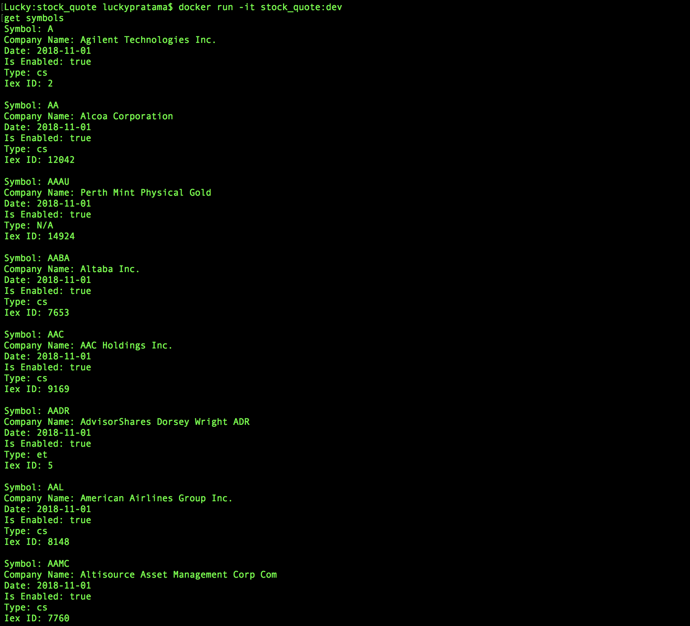
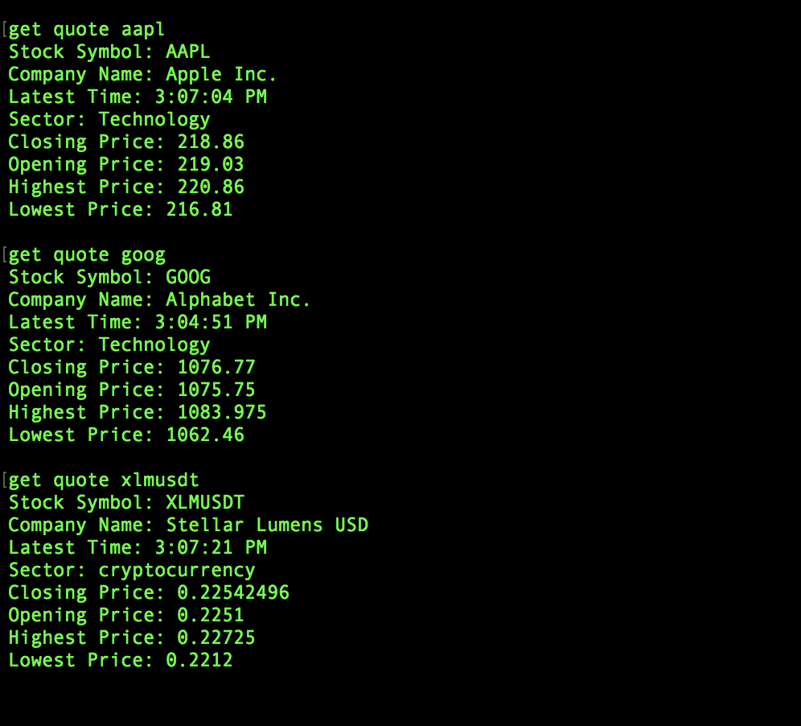

<h1>Stock Quote</h1>

This project is a REST Consumer which consume stock data from<a href="https://iextrading.com"> IEX API</a> using java.

To pull the image from <a href="https://hub.docker.com/r/luckyp71/stock_quote/">docker hub</a> just simply run <strong>docker pull luckyp71/stock_quote</strong> command

<h2>Prerequisites</h2>

1. Java 8

2. Jackson

3. Maven
 

4. Docker

<h2>Step to run the program</h2>

1. Cleaning, installing, and packaging the project by using maven command i.e. <strong>mvn clean install package</strong>.

2. Create docker image of this project by using docker-compose command i.e. <strong>docker-compose up -d --build</strong>

3. Run stock_quote:dev image by running <strong>docker run -it stock_quote:dev</strong> command

4. Enter the particular command for particular purpose, please check the detail <a href="./src/main/resources/input.txt">here</a>

<h2>Retrieve Stock Symbols Data</h2>

<h2>Retrieve Stock Quote Data</h2>

